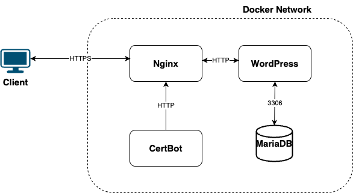

# 🐳 WordPress Docker Stack

Une stack pour exécuter WordPress en local avec :

- NGINX comme reverse proxy  
- WordPress via PHP-FPM  
- MariaDB comme base de données 
- Certbot pour le HTTPS 
- Configuration NGINX personnalisée

---

## ✅ Prérequis

Avant de commencer, assure-toi d’avoir installé :

- [Docker](https://docs.docker.com/get-docker/)
- [Docker Compose](https://docs.docker.com/compose/install/)
- macOS, Linux ou WSL2 (Windows)

Vérifie avec :

```bash
docker --version
docker compose version
```

---

## 📦 Composition de la stack



| Service     | Rôle                                  | Port exposé |
|-------------|---------------------------------------|-------------|
| wordpress   | Application WordPress en PHP-FPM      | N/A         |
| db          | Base de données MariaDB               | 3306        |
| nginx       | Serveur web et reverse proxy          | 80,443      |
| certbot	  | Génération et renouvellement SSL	  | N/A         |
---

## 🚀 Lancer le projet

### 1. Cloner le dépôt

```bash
git clone https://github.com/abir-benelhadj/wordpress-docker-nginx.git
cd wordpress-docker-nginx
```

### 2. Démarrer les conteneurs

```docker compose up -d```

### 3. Accéder à l'installation

Ouvre le navigateur sur : http://localhost

## 🛠️ Détails de configuration

### Base de données (MariaDB)

- Nom : `wordpress`  
- Utilisateur : `wp_user`  
- Mot de passe : `wp_pass`  
- Mot de passe root : `rootpass`  

Ces valeurs peuvent être modifiées dans le fichier `docker-compose.yml`.

---

## 🧾 Structure du projet

wordpress-docker-nginx/  
├── docker-compose.yml  
├── nginx/  
│   └── default.conf  
├── wordpress/  
│   └── wp-config.php (généré automatiquement)  
├── renouvellement_certificat.sh 
├── certbot/ 
└── db-data/  (volume persistant MariaDB)

---

## 🔐 HTTPS

Pour utiliser un nom de domaine et le securiser, nous avons configurer `certbot` dans un conteneur dédié
Les certificats Let's Encrypt sont automatiquement générés lors du premier déploiement si les ports 80 et 443 sont accessibles publiquement.

    🔔 Configuré le DNS du domaine pour qu’il pointe vers ta machine.

---

## 🚢 Étapes de déploiement avec HTTPS

    ⚠️ Lance d’abord la stack sans le conteneur certbot pour permettre à NGINX de démarrer correctement.

### 🛑 1.Démarrer sans Certbot

Dans le fichier docker-compose.yml, commente la section certbot: puis exécute :

```docker compose up -d nginx wordpress db```

### ✅ 2. Obtenir les certificats SSL

Une fois que NGINX est prêt et accessible, exécute Certbot une seule fois pour générer les certificats :

```docker compose run --rm certbot```

### 🔁 3. Redémarrer NGINX

Pour que NGINX prenne en compte les fichiers SSL générés :

```docker compose restart nginx```

## 🔁 Renouvellement automatique SSL

Les certificats Let's Encrypt sont valables 90 jours. Il est recommandé de configurer un renouvellement automatique toutes les 2 mois environ.

### 🔃 Renouvellement manuel

```docker compose run --rm certbot renew```

```docker compose restart nginx```

### ⏰ Exemple de tâche cron

Ajouter cette ligne à crontab -e pour renouveler tous les mois :

0 22 * * * ~/wordpress-docker-nginx/renouvellement_certificat.sh >> ~/renouvellement_certificat.log

📄 Le fichier `renouvellement_certificat.sh` contient les commandes pour renouveler automatiquement les certificats SSL avec Certbot. Ce script est utilisé dans la tâche cron ci-dessous.

## 🧼 Nettoyage

### Arrêter les conteneurs :

```docker compose down```

### Supprimer les volumes (base de données incluse) :

```docker compose down -v```


